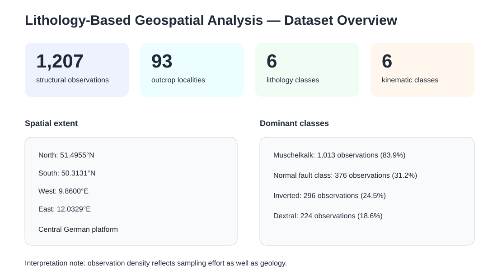
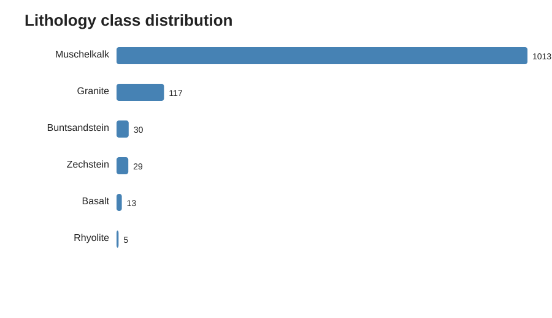
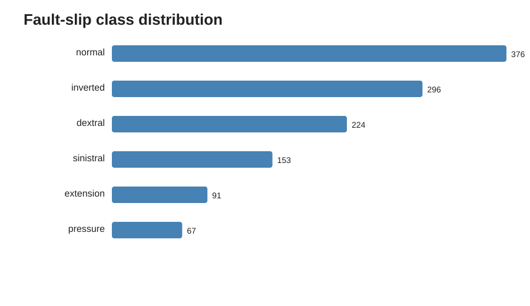

# Lithology-Based Geospatial Analysis in Map

A reproducible Python research project for analysing structural-geology observations from the central German platform. The workflow validates fault-slip records, standardizes structural orientation, derives lithology-aware features, produces geospatial diagnostics, and exports GIS-ready summaries.



## Dataset
The analysis targets **1,207 structural observations from 93 outcrop localities**. The public source is PANGAEA dataset **doi:10.1594/PANGAEA.893245**.

**Spatial extent:** 50.3131–51.4955°N, 9.8600–12.0329°E.

## What the project includes
- schema and numeric-range validation
- deterministic cleaning and feature engineering
- explicit right-hand-rule strike normalization
- lithology and fault-kinematic maps
- class-distribution diagnostics
- normalized lithology × fault-type comparison
- strike rose diagram and dip-angle distributions
- sampling-density visualization
- locality-level GeoJSON export
- tests, CI, reproducibility guide, and sanitized notebook

## Descriptive profile
| Category | Count |
|---|---:|
| Muschelkalk | 1,013 |
| Granite | 117 |
| Buntsandstein | 30 |
| Zechstein | 29 |
| Basalt | 13 |
| Rhyolite | 5 |

Fault-slip classes: normal 376, inverted 296, dextral 224, sinistral 153, extension 91, pressure 67.





## Reproduce
```bash
python -m venv .venv
source .venv/bin/activate
pip install -e ".[geo,dev]"
# place the source table at data/raw/2018_Navabpour_Fault-slip.tab
python scripts/09_generate_all.py
pytest -q
```

## Repository layout
```text
src/lithomap/      reusable analysis package
scripts/           executable pipeline stages
config/            reproducible configuration
data/derived/      compact aggregate summaries
docs/              methodology, findings, limitations
notebooks/         sanitized exploratory workflow
assets/            GitHub-renderable visualization previews
report/            concise analysis summary
tests/             automated checks
```

## Interpretation safeguard
Observation density is not automatically geological abundance. Lithology and locality sampling are strongly imbalanced, so the project reports sampling structure and normalized comparisons alongside raw counts.
